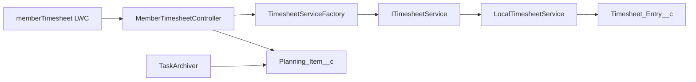

# Member timesheet

A Salesforce member view for recording time against assigned tasks. The Lightning Web Component presents a week of day tabs alongside pending work. The Apex controller checks ownership and restricts time-entry changes to the current week.

Time entries remain separate records, even for the same task and day. Duration is selected in 15-minute steps from 15 minutes to 12 hours. Members can create tasks, complete or reopen them, and view past weeks. This repository contains the member view; an assignment interface is absent.



The service interface separates time-entry storage from controller rules. The included implementation uses custom development-org objects; integration with a real timesheet schema is unfinished.

## Try it in a development org

Requires Salesforce CLI and an authenticated development org. From this folder, replace `YOUR_DEV_ORG` with its alias:

```sh
sf project deploy start --source-dir force-app --target-org YOUR_DEV_ORG
sf org assign permset --name SPT_Team_Member --target-org YOUR_DEV_ORG
sf apex run test --test-level RunLocalTests --target-org YOUR_DEV_ORG --result-format human --wait 10
```

Open the Member Timesheet tab in Salesforce. The optional `scripts/apex/seed.apex` deletes existing planning items before inserting ten examples; use it only in a disposable development org.

Three Apex test classes are present. Deployment and test execution were not verified in this review. Archiving is manual via `scripts/apex/archive.apex`; no scheduled job is included.

[Design decisions and remaining integration work](DECISIONS.md)

The current controller test source contains a method name with a space (`renameTaskRejectsAthe managerAssignedTask`). That naming error needs correcting before an Apex compile can succeed. No code was changed in this documentation review.
